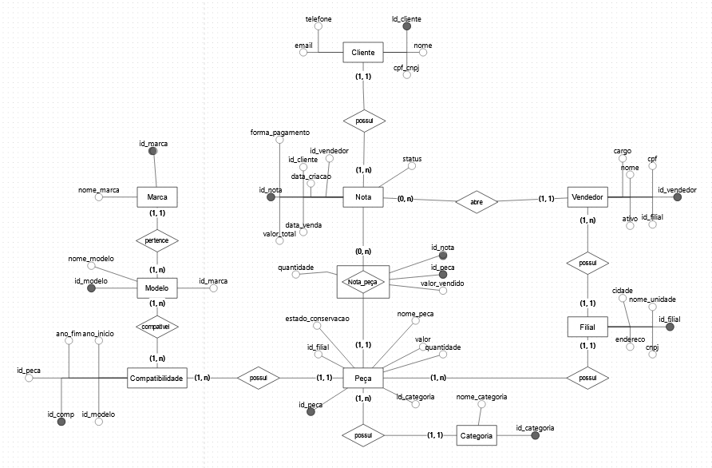

# 🏎️ AutoRecicla - Sistema de Gestão de Autopeças Usadas

Trabalho Final apresentado à disciplina de **Banco de Dados II** como requisito parcial para a conclusão de Banco de Dados II. O projeto consiste no design, modelagem e implementação de um Banco de Dados Relacional robusto para gerenciar uma rede distribuída de desmonte e revenda de autopeças usadas.

---

## 👥 Colaboradores
* **[Nicolas Damasceno / Link do GitHub: https://github.com/NicolasDamasceno]**
* **[Renato  / Link do GitHub: https://github.com/renPaiva-dev]**

---

## 📖 O Contexto do Negócio

A **AutoRecicla** é uma grande rede de centros de desmonte (ferro-velho) e venda de peças de carros usados com atuação dividida em múltiplas filiais. O ecossistema exige um controle rigoroso de rastreabilidade, inventário e compatibilidade de componentes entre diferentes marcas e modelos de veículos.

### Fluxo Operacional: Nota Única
O sistema elimina a necessidade de tabelas separadas para o fechamento financeiro, concentrando o ciclo de vida da transação na entidade **Nota**. 
1. O processo inicia-se no balcão, onde um **Vendedor** atende o **Cliente** e abre uma **Nota** (Status: `Aberto`).
2. As peças desejadas são vinculadas à nota, alterando temporariamente seus estados no estoque para evitar duplicidade de venda.
3. O cliente direciona-se ao caixa, onde a forma de pagamento é registrada, o valor total é processado e a nota é consolidada (Status: `Finalizado`), oficializando a venda.

---

## 🚀 Escopo Técnico

O sistema implementa os seguintes recursos nativos no SGBD (PostgreSQL) a fim de manter um controle, integridade e controle de acesso aos dados: 
* **Triggers de Validação de Filial:** Garante de forma automatizada que um vendedor consiga adicionar à nota apenas peças que pertençam fisicamente ao estoque da sua respectiva **Filial**.
* **Triggers de Estado de Estoque:** Automatiza a transição de status das peças (`Disponível` ➡️ `Reservada` ➡️ `Vendida`) à medida que itens são adicionados à nota ou quando o pagamento é finalizado.
* **Views de Inteligência de Negócio:** Visões consolidadas e agregadas para apuração de faturamento por categoria de peça, desempenho individual de vendedores e métricas de vendas por filial.
* **Controle de Acesso Dinâmico (DCL):** Criação de perfis de usuários com privilégios de acesso restritos de acordo com a função administrativa.

---

## 🗂️ Dicionário de Dados & Estrutura das Tabelas

### 1. FILIAL
* `id_filial` (PK - int)
* `nome_unidade` (varchar)
* `cidade` (varchar)
* `endereco` (varchar)
* `cnpj` (varchar, unique)

### 2. VENDEDOR
* `id_vendedor` (PK - int)
* `nome` (varchar)
* `cpf` (varchar, unique)
* `id_filial` (FK - int)
* `ativo` (boolean, default true)
* `cargo` (varchar)

### 3. CLIENTE
* `id_cliente` (PK - int)
* `nome` (varchar)
* `cpf_cnpj` (varchar, unique)
* `telefone` (varchar)
* `email` (varchar)

### 4. MARCA
* `id_marca` (PK - int)
* `nome_marca` (varchar, unique)

### 5. MODELO
* `id_modelo` (PK - int)
* `nome_modelo` (varchar)
* `id_marca` (FK - int)

### 6. CATEGORIA
* `id_categoria` (PK - int)
* `nome_categoria` (varchar, unique)

### 7. PEÇA
* `id_peca` (PK - int)
* `nome_peca` (varchar)
* `valor` (numeric(10,2))
* `estado_conservacao` (varchar) — *[Novo, Seminovo, Usado]*
* `id_categoria` (FK - int)
* `id_filial` (FK - int)
* `quantidade` (int)

### 8. COMPATIBILIDADE (Tabela Associativa N:N)
* `id_comp` (PK - int)
* `id_peca` (FK - int)
* `id_modelo` (FK - int)
* `ano_inicio` (smallint)
* `ano_fim` (smallint)

### 9. NOTA (Entidade Consolidada de Atendimento e Venda)
* `id_nota` (PK - int)
* `data_criacao` (timestamp, default now())
* `data_venda` (timestamp - null se em aberto)
* `status` (varchar) — *[Aberto, Finalizado, Cancelado]*
* `forma_pagamento` (varchar - null se em aberto) — *[Pix, Dinheiro, Cartão de Crédito, Cartão de Débito, Boleto]*
* `valor_total` (numeric(10,2) - calculado via trigger)
* `id_cliente` (FK - int)
* `id_vendedor` (FK - int)

### 10. NOTA_PEÇA (Tabela Associativa N:N)
* `id_nota` (FK - int)
* `id_peca` (FK - int)
* `valor_vendido` (numeric(10,2))
* `quantidade` (int)

---

## 📐 Diagrama Entidade-Relacionamento (DER)

## 🛠️ Tecnologias Utilizadas
* **SGBD:** PostgreSQL (Versão 15+)
* **Modelagem:** brModelo
* **Versionamento:** Git & GitHub
